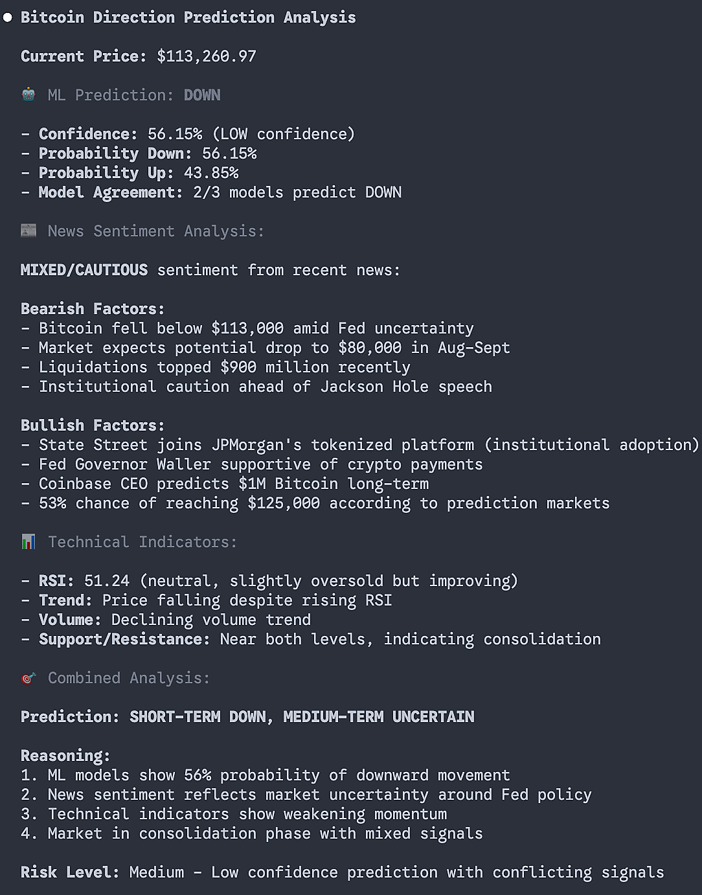
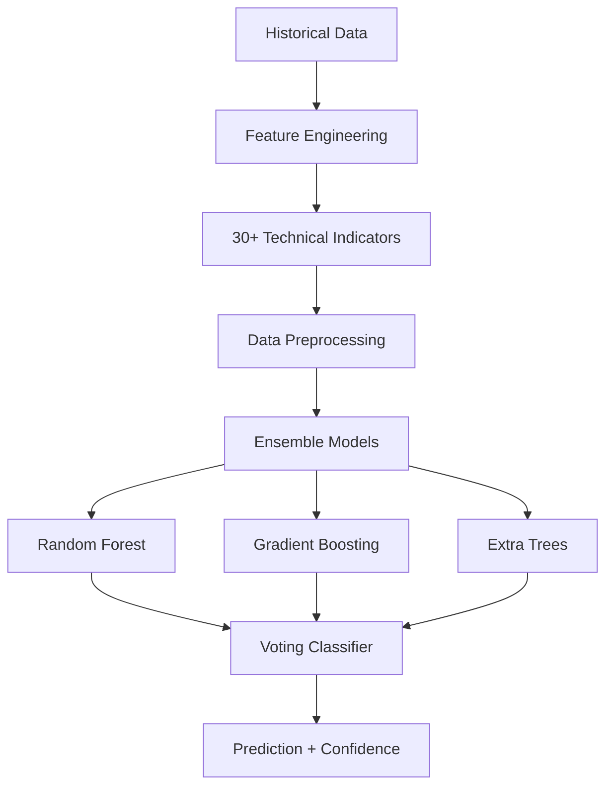

<div align="center">

# 📈 CryptoSignal MCP

[](https://python.org)
[](https://github.com/modelcontextprotocol)
[](LICENSE)
[](https://binance.com)

**AI-Powered Cryptocurrency Direction Prediction & Market Signal Analysis**

*Powered by Machine Learning Ensemble Models with 30+ Technical Indicators*

[Features](#-features) • [Installation](#-installation) • [API Tools](#-api-tools) • [Examples](#-usage-examples) • [Indicators](#-technical-indicators)

</div>

## 🎬 Demo

<div align="center">
  
  <p><em>CryptoSignal MCP in action - Real-time crypto direction predictions with confidence scores</em></p>
</div>

---

## ✨ Features

| Feature | Description |
|---------|-------------|
| 🧠 **Advanced ML Predictions** | Ensemble models (Random Forest + Gradient Boosting) with 30+ technical indicators |
| 📊 **Comprehensive Technical Analysis** | RSI, MACD, Bollinger Bands, Stochastic, Williams %R, ATR, and more |
| ⏰ **Multiple Timeframes** | Support for 1m, 3m, 5m, 15m, 30m, 1h, 2h, 4h, 6h, 8h, 12h, 1d, 3d, 1w, 1M |
| 🔄 **Real-time Data** | Live market data from Binance API with intelligent rate limiting and caching |
| 🎯 **Smart Filtering** | Automatically filters incomplete trading periods for accurate analysis |
| 🔍 **WebSearch Integration** | Optimized search queries for Claude Code's WebSearch tool with sentiment analysis prompts |
| 📊 **Polymarket Trader Analysis** | Monitor successful crypto traders' activities, positions, and trading patterns for behavioral insights |

## 🚀 Installation

### Prerequisites
- **Python 3.11+**
- **Required packages** (automatically installed)

### Quick Start

```bash
# Clone the repository
git clone https://github.com/khalilbalaree/CryptoSignal-MCP.git
cd CryptoSignal-MCP

# Install dependencies
pip install -r requirements.txt

# Run the server
python crypto_predictor_server.py
```

### 🔧 MCP Integration

#### With Claude Desktop

Add this server to your Claude Desktop configuration:

**macOS:** `~/Library/Application Support/Claude/claude_desktop_config.json`  
**Windows:** `%APPDATA%/Claude/claude_desktop_config.json`

```json
{
  "mcpServers": {
    "cryptosignal-mcp": {
      "command": "python",
      "args": ["/path/to/CryptoSignal-MCP/crypto_predictor_server.py"],
      "env": {}
    }
  }
}
```

## 🛠️ API Tools

### 🎯 `predict_crypto_direction`
> **Advanced ML prediction using ensemble models to predict price direction**

```python
predict_crypto_direction(
    symbol="BTCUSDT",           # Trading pair
    interval="1h",              # Time interval (default: 1h)
    training_periods=1000       # Training data size (default: 1000)
)
```

**Supported Intervals:** `1m` `3m` `5m` `15m` `30m` `1h` `2h` `4h` `6h` `8h` `12h` `1d` `3d` `1w` `1M`

**Returns:** Prediction direction, confidence scores, model performance, market context, feature importance, risk assessment

---

### 📈 `analyze_crypto_indicators`
> **Fast technical analysis without ML training - immediate market insights**

```python
analyze_crypto_indicators(
    symbol="ETHUSDT",           # Trading pair
    interval="1h",              # Time interval (default: 1h)
    limit=100,                  # Data points (default: 100)
    short_period=5,             # Short-term period (default: 5)
    medium_period=10,           # Medium-term period (default: 10)
    long_period=20              # Long-term period (default: 20)
)
```

**Returns:** Moving averages, trends, momentum analysis, volatility metrics, support/resistance levels, trend signals

---

### 🔍 `get_crypto_news_search`
> **Generate optimized search queries for Claude Code's WebSearch tool**

```python
get_crypto_news_search(
    symbol="bitcoin"            # Crypto symbol (default: bitcoin)
)
```

**Returns:** Structured search data including optimized queries, reliable domains, and analysis prompts for use with Claude Code's WebSearch tool

---

### 📊 `monitor_polymarket_trader`
> **Analyze successful crypto traders' positions and patterns on Polymarket**

```python
monitor_polymarket_trader(
    trader_address="0x1234567890abcdef1234567890abcdef12345678",  # Ethereum wallet address
    limit=100                                                    # Activities to fetch (default: 100)
)
```

**Returns:** Complete trading activity history including positions, bet sizes, outcomes, timing, and P&L performance across crypto prediction markets

## 💡 Usage Examples

<details>
<summary><b>🔰 Basic Predictions</b></summary>

```python
# Get ML prediction for Bitcoin (1-hour timeframe)
predict_crypto_direction("BTCUSDT", "1h", 1000)

# Quick technical analysis for Ethereum (4-hour timeframe)
analyze_crypto_indicators("ETHUSDT", "4h", 200)

# Get search query for Bitcoin news analysis
get_crypto_news_search("bitcoin")

# Monitor successful crypto trader's activities
monitor_polymarket_trader("0x1234567890abcdef1234567890abcdef12345678", 100)
```

</details>

<details>
<summary><b>⚡ Advanced Trading Scenarios</b></summary>

```python
# Short-term scalping prediction (15-minute intervals)
predict_crypto_direction("BTCUSDT", "15m", 500)

# Long-term investment analysis (daily timeframe)
analyze_crypto_indicators("ETHUSDT", "1d", 365, 10, 20, 50)

# Custom altcoin analysis
analyze_crypto_indicators("ADAUSDT", "2h", 100, 3, 7, 14)

# Multi-timeframe analysis
for timeframe in ["1h", "4h", "1d"]:
    analyze_crypto_indicators("BTCUSDT", timeframe)

# Copy trading successful traders
successful_traders = [
    "0x1234567890abcdef1234567890abcdef12345678",
    "0xabcdef1234567890abcdef1234567890abcdef12"
]
for trader in successful_traders:
    monitor_polymarket_trader(trader, 100)
```

</details>

## 📊 Technical Indicators

Our ML models leverage **30+ advanced technical indicators** across multiple categories:

<div align="center">

| Category | Indicators |
|----------|------------|
| **📈 Price & Momentum** | Price change, acceleration, velocity<br/>Momentum (3, 5, 10, 20 periods)<br/>Rate of change, Sharpe ratio |
| **📉 Moving Averages** | Simple MA (5, 10, 20, 50)<br/>Exponential MA (5, 12, 26, 50)<br/>MA ratios and crossover signals |
| **🎯 Oscillators** | RSI (7, 14 periods)<br/>Stochastic Oscillator (K%, D%)<br/>Williams %R |
| **🔊 Volume Analysis** | Volume ratios and rate of change<br/>On-Balance Volume (OBV)<br/>Volume spikes and trends |
| **📐 Volatility & Bands** | Bollinger Bands (width, position)<br/>Average True Range (ATR)<br/>Volatility regimes |
| **🏗️ Market Structure** | Support/resistance levels<br/>Fractal patterns (local max/min)<br/>Trend strength and regime detection |

</div>

## 🎯 Model Architecture



## ⚠️ Risk Disclaimer

> **🚨 IMPORTANT:** This tool is designed for **educational and research purposes only**. 
> 
> Cryptocurrency trading involves **significant financial risk**. Past performance does not guarantee future results. Always:
> - Conduct your own research and analysis
> - Implement proper risk management strategies  
> - Never invest more than you can afford to lose
> - Consider seeking advice from qualified financial professionals

## 📄 License

This project is licensed under the MIT License - see the [LICENSE](LICENSE) file for details.

---

<div align="center">

**Built with ❤️ for the crypto community**

[⭐ Star this repo](https://github.com/khalilbalaree/CryptoSignal-MCP) • [🐛 Report Issues](https://github.com/khalilbalaree/CryptoSignal-MCP/issues) • [💡 Request Features](https://github.com/khalilbalaree/CryptoSignal-MCP/discussions)

</div>